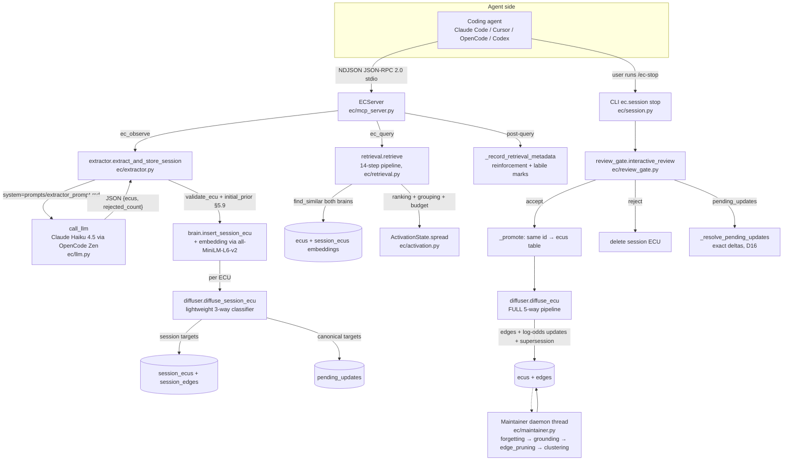
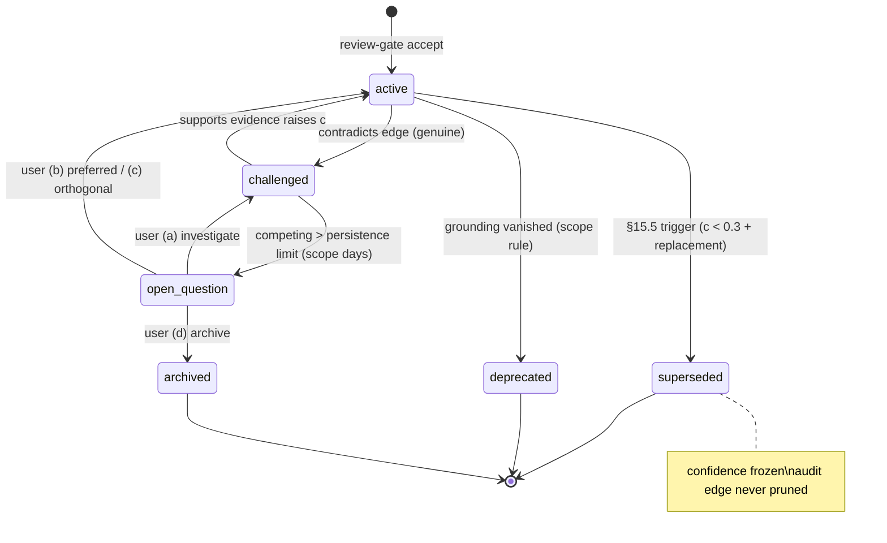
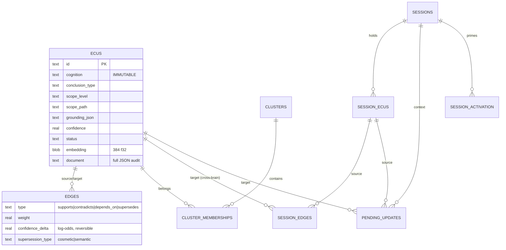

# Reverie — Product & Technical Archaeology

**Date of archaeology:** 2026-10-04
**Repo:** `EMS-v2` (working package directory `ec/`)
**Method:** read-only inspection of every module in `ec/`, `schema.sql`, the test suite (run live), the EC-Bench harness and its stored run artifacts, plus the docs tree — then writing only what the code actually does. Every claim below cites a file path. Where documentation and code disagree, the discrepancy is flagged.

> **Naming fact:** the product's package name is `engineering-cognition`, import name is `ec`, and the code nowhere contains the string "Reverie". The name appears exactly once in the docs: `docs/EC_TECHNICAL_REFERENCE.md` §1.1 — "Engineering Cognition (EC, **internally also called Reverie**)". "Reverie" is a brand label, not an identifier. This document uses "EC/Reverie" interchangeably.

---

## Table of contents

1. [Product summary](#1-product-summary)
2. [Installation & getting started](#2-installation--getting-started)
3. [Agent integrations](#3-agent-integrations)
4. [The complete pipeline](#4-the-complete-pipeline)
5. [ECU schema](#5-ecu-schema)
6. [Extraction](#6-extraction)
7. [Diffusion](#7-diffusion)
8. [Session brain](#8-session-brain)
9. [Canonical brain](#9-canonical-brain)
10. [Human review](#10-human-review)
11. [Confidence system](#11-confidence-system)
12. [Relationships / edges](#12-relationships--edges)
13. [Retrieval](#13-retrieval)
14. [Maintenance](#14-maintenance)
15. [Storage](#15-storage)
16. [Observability / debugging](#16-observability--debugging)
17. [EC-Bench](#17-ec-bench)
18. [Testing](#18-testing)
19. [User-visible product surface](#19-user-visible-product-surface)
20. [Website-worthy features](#20-website-worthy-features)
21. [Product strengths](#21-product-strengths)
22. [Product weaknesses / unfinished areas](#22-product-weaknesses--unfinished-areas)
23. [Website-ready facts](#23-website-ready-facts)

---

## 1. Product summary

**What Reverie is today (implementation, not aspiration):** a pip-installable Python 3.12 package (`engineering-cognition` v0.1.0, import name `ec`, ~10,200 lines under `ec/`) that gives AI coding agents a **persistent, local, self-updating memory of engineering conclusions** — not chat history, not facts, but *beliefs* with confidence, scope, provenance, grounding references to code, and typed relationships to other beliefs.

- **Who it is for:** developers using MCP-capable coding agents (Claude Code, Cursor, OpenCode, Codex are the four the installer supports — `ec/install.py:698`).
- **Problem it solves:** an agent re-derives the same engineering understanding every session. Reverie extracts the *conclusions* an agent reaches while working ("auth correctness depends on optimistic token refresh…"), stores them in a local SQLite brain, and re-serves them — with confidence and status flags — to future agent sessions on demand.
- **What it connects to:** one stdio MCP server per agent process (`ec/mcp_server.py`), a session-lifecycle CLI, and one LLM endpoint for extraction/classification (OpenCode Zen / Claude Haiku 4.5 by default; Ollama as offline fallback — `ec/llm.py`, `ec/install.py:286-310`).
- **What happens when an agent uses it:** the agent calls `ec_observe` after reaching engineering conclusions (extraction → session brain → lightweight diffusion), calls `ec_query` when it needs past cognition (demand-driven retrieval over both brains), and the user closes the loop with `/ec-stop`, which walks a human review gate before anything reaches the durable "Canonical Brain".
- **What persists between sessions:** the Canonical Brain (`ecus` + `edges` tables), closed session rows, unreviewed/skipped session ECUs (carried into the next session on the same repo+branch), maintenance logs, and per-ECU retrieval metadata. What does **not** persist: activation scores (deleted at stop), the "labile" set of retrieved ECUs (in-memory only).
- **What it does that chat history does not:**
  - It stores *irreducible conclusions* with an explicit Lifting Test that rejects raw facts, code descriptions, and process steps (`ec/prompts/extractor_prompt.md`).
  - Beliefs carry **calibrated confidence in log-odds space** that is Bayesian-updated by later evidence, decays over time by scope, and is reinforced by retrieval (`ec/confidence.py`).
  - Beliefs are **linked**: supports / contradicts / supersedes / depends_on edges propagate the effects of new evidence (`ec/diffuser.py`).
  - Contradictions don't silently overwrite: they mark the old belief `challenged`, can park competing hypotheses as `open_question` after a scope-dependent timeout, and are surfaced to a human (`ec/review_gate.py`, `ec/maintainer.py`).
  - Grounding is **verified against the live repo**: if the files/symbols an ECU cites disappear, the ECU is deprecated and its dependents challenged (`ec/grounding.py`).
  - Nothing reaches durable memory without a **human review gate** (`ec/review_gate.py:1-23`).

**What Reverie is *not* (as built):** not a hosted service, not an HTTP API, not a vector database, not a GUI. It is one Python process per agent session, one SQLite file (`~/.ec/ec.db` shared across all projects), and short-lived CLI subprocesses.

---

## 2. Installation & getting started

### 2.1 Package facts

| Fact | Value | Source |
|---|---|---|
| Distribution name | `engineering-cognition` | `pyproject.toml:6` |
| Version | 0.1.0 | `ec/__init__.py:8` |
| Python | `>=3.12` | `pyproject.toml:9` |
| License | **none declared in `pyproject.toml`; no LICENSE file in the repo.** The extractor prompt file claims MIT for itself (`ec/prompts/extractor_prompt.md:5`) | verified by `find` |
| README | **does not exist** anywhere in the repo | verified |
| Install | `pip install -e .` from repo root (editable install was used on this machine; `engineering_cognition.egg-info/` present) | `pyproject.toml` |

### 2.2 Pinned dependencies (`pyproject.toml:10-20`)

```
torch==2.2.2, numpy<2, scipy<1.13, scikit-learn<1.5, transformers<5,
sentence-transformers==3.0.1, hdbscan>=0.8.33, requests, pyyaml
# optional dev: pytest>=7.0
```

The torch/sentence-transformers stack exists solely for the local embedding model (`all-MiniLM-L6-v2`, 384-dim, `ec/embeddings.py`). This is the heaviest part of the install.

### 2.3 Console scripts (`pyproject.toml:25-31`)

| Command | Entry point | What it does |
|---|---|---|
| `ec` | `ec.install:main` | One-shot installer for detected agents + `~/.ec` bootstrap |
| `ec-mcp` | `ec.mcp_server:main` | Launches the MCP server (stdio) |
| `ec-start` | `ec.session:main_start` | Start/resume session for (repo, branch) |
| `ec-stop` | `ec.session:main_stop` | Close session via the review gate |
| `ec-status` | `ec.session:main_status` | Print brain + session status |
| `ec-repair` | `ec.repair:main` | Brain integrity check + safe recovery (`--dry-run`, `--db`) |

Module forms also work: `python -m ec.install [--all | --only claude_code,cursor,opencode,codex] [--dry-run]`, `python -m ec.session {start|stop|status} [--repo …] [--branch …] [--all-accept | --all-skip] [--resolve-open-questions auto|skip|archive]`, `python -m ec.mcp_server`, `python -m ec.run_ecbench`.

### 2.4 Environment variables

| Variable | Purpose | Read by |
|---|---|---|
| `EC_HOME` | Redirect the brain root (default `~/.ec`); tests use it for isolation | `ec/config.py:29-31` |
| `OPENCODE_ZEN_API_KEY` | LLM API key (extraction, classification, mode detection) | `ec/llm.py:52-55` |
| `EC_REPO_PATH` + `EC_BRANCH` | Override repo/branch detection (both required together) | `ec/session.py:54,98-100` |
| `EC_EXTRACTOR_PROMPT` | Override the extraction prompt path | `ec/extractor.py:38,86-88` |
| `HF_HUB_OFFLINE` | (tests/bench) keep HuggingFace offline | `tests/test_e2e_integration.py:29` |
| `OPENCODE_CONFIG` | (bench only) inject per-condition agent config | `ec/run_ecbench.py:319` |

### 2.5 Database & config setup

- **Database:** `~/.ec/ec.db` — one SQLite (WAL) database for **all** projects, auto-created with the full 11-table schema on first `Brain()` open (`ec/brain.py:71-105`, `ec/schema.sql`). No migration runner: schema re-applies additively on every connect plus one PRAGMA-guarded `ALTER TABLE` for pre-existing DBs (`ec/brain.py:94-104`).
- **Config:** `~/.ec/config.yaml` deep-merges over `DEFAULT_CONFIG` in `ec/config.py:47-280`. The installer writes the full defaults as a starting file (`ec/install.py:716-725`).

### 2.6 What `ec install` actually writes (`ec/install.py`)

| Target | File(s) | Notes |
|---|---|---|
| `~/.ec/` | `ec.db` (created via `Brain()`), `config.yaml` (defaults), `AGENTS.md` (verbatim 163-line agent instructions), `commands/ec-start.md`, `commands/ec-stop.md`, `commands/ec-status.md` | `ec/install.py:706-735` |
| Claude Code | `~/.claude.json` (`mcpServers.ec`, stdio) + `@~/.ec/AGENTS.md` import appended to `~/.claude/CLAUDE.md` | `_ClaudeCode.plan` |
| Cursor | `~/.cursor/mcp.json` + `~/.cursor/rules/ec.md` | `_Cursor.plan` |
| OpenCode | `~/.config/opencode/opencode.json` (`mcp.ec`, type local, `environment` key) + block in `~/.config/opencode/AGENTS.md` | `_OpenCode.plan` |
| Codex | `~/.codex/config.toml` `[mcp_servers.ec]` TOML table + `~/.codex/AGENTS.md` | `_Codex.plan` |

- Idempotent and merge-only: existing agent config is preserved; only the `ec` entry is added/replaced; every write is a computed `PlannedWrite` and `--dry-run` prints full content before writing nothing (`ec/install.py:406-494,750-758`).
- **Server command resolution:** when pip-installed, agent configs launch `ec-mcp` (console script); otherwise the absolute venv python + `-m ec.mcp_server` + `PYTHONPATH=<repo root>` (D45/D28 — `ec/install.py:366-403`). This fixed the original blocker where a bare `python` could not import `ec` outside the repo (`docs/ASSESSMENT.md` §3c).
- **Offline fallback (D42):** with no Zen key and `ollama` on PATH, the installer offers to rewrite `~/.ec/config.yaml` to `provider: ollama, model: qwen2.5-coder:14b, base_url: http://localhost:11434/v1` and pulls the model (never fatal) — `ec/install.py:286-310, 871-916`.

### 2.7 Getting started (exact, as a user would run it)

```bash
# from the repo root
pip install -e .[dev]
ec --all                        # or: ec   (interactive selection of detected agents)
export OPENCODE_ZEN_API_KEY='your-key'   # https://opencode.ai/auth

cd your-project                 # must be a git repo (branch detection)
ec-start                        # start/resume session; prints brain summary
# ... work with your agent; it calls ec_observe / ec_query via MCP ...
ec-stop                         # interactive review gate; or --all-accept / --all-skip
ec-status                       # anytime
```

Modes: **local-only** (single machine, single user). There is no server/production mode, no multi-user support, no HTTP API. "Development mode" = editable install + `PYTHONPATH`; "production mode" = pip install + `ec-mcp`.

---

## 3. Agent integrations

### 3.1 MCP server (`ec/mcp_server.py`)

- **Transport:** stdio, **newline-delimited JSON-RPC 2.0** (one message per line), protocol version `2024-11-05`, server name `ec` (`mcp_server.py:79-80`). Hand-rolled — the `mcp` SDK is deliberately not a dependency (D14). Logging goes to stderr only; stdout is protocol-only.
- **Implemented methods:** `initialize`, `ping`, `tools/list`, `tools/call`. Notifications are never answered. **Not implemented:** batching, progress, cancellation, `resources/*`, `prompts/*` — Reverie exposes **tools only, no resources and no prompts** (`handle_message`, `mcp_server.py:419-440`).
- **Session model:** the server never creates sessions. It resolves the current session per call via `(repo, branch)` detection (git, or `EC_REPO_PATH`/`EC_BRANCH`), reading the same SQLite DB the CLI uses — WAL makes CLI/MCP interoperation safe (D15). Without an active session, `ec_observe`/`ec_query` return the verbatim error: *"No active EC session. Suggest the user run /ec-start to begin a session."* (`mcp_server.py:83-85`).
- **Lifecycle side effects inside the server:**
  - Startup: if maintenance is overdue, it runs synchronously **before** serving, then a daemon `MaintainerThread` runs for the process lifetime (`start_maintenance`, `mcp_server.py:366-391`).
  - After each successful `ec_query`: canonical ECUs that were surfaced get `last_retrieved`/`retrieval_count` stamped, **stored confidence bumped** by `alpha_retrieval` (log-odds), `last_reinforced` reset (the lazy-decay clock restarts), and the ids marked *labile* (reconsolidatable). Frozen-status ECUs keep the bookkeeping but skip the bump (`_record_retrieval_metadata`, `mcp_server.py:481-526`).
  - Every `ec_observe` stamps the session repo's git HEAD (12-char short hash) into each extracted ECU's grounding before storage (D49, `mcp_server.py:101-123,565`).

### 3.2 The four MCP tools (complete surface)

| Tool | Purpose | Input parameters | Output (payload keys) | When the agent should use it | Implementation |
|---|---|---|---|---|---|
| **`ec_observe`** | Extract conclusions from the agent's own reasoning → Session Brain → lightweight diffusion | `user_prompt`* (string), `reasoning_trace`* (string), `final_output` (optional string) | `status, session_active, ecus_extracted, ecus_rejected, rejection_summary, session_brain_count, message, skipped_invalid, diffusion_failures` | After discovering an invariant/root cause/decision/changed assumption — not for simple code changes | `mcp_server.py:530-607` → `extractor.extract_and_store_session` → `diffuser.diffuse_session_ecu` |
| **`ec_query`** | Demand-driven retrieval of past cognition (both brains) | `query`* (string), `scope` (enum of 6 levels), `mode` (enum of 5 modes) | `status, mode, mode_detected, budget, budget_used, groups_retrieved, groups[] (core_ecu + 4 edge slots), warnings, brain_source, message, formatted, fallback, filtered_out, cross_group_dedup_count, session_active` | After reading relevant code, before decisions/debugging/architecture work — never before grounding in the repo (anti-anchoring, verbatim in tool description) | `mcp_server.py:609-646` → `retrieval.retrieve` |
| **`ec_get_summary`** | Brain statistics, once at session start ("awareness without anchoring") | none | `canonical_brain{total_ecus, by_scope, by_status, last_maintenance_run, last_ecu_added, pending_review_count}, session{active, session_brain_count, started_at, repo, branch}, message` | Once per session start; works **without** an active session | `mcp_server.py:648-654` → `session.brain_summary` |
| **`ec_reconsolidate`** | Re-evaluate a *previously retrieved* canonical ECU with new evidence; writes to Canonical Brain immediately | `ecu_id`* (string), `evidence`* (string), `relationship` (optional: supports/contradicts/supersedes) | `status, session_active, ecu_id, action_taken (confidence_updated\|challenged\|superseded\|no_change), new_confidence, old_confidence, edges_created, message` | When verified evidence shows a retrieved ECU is wrong/outdated/needs strengthening | `mcp_server.py:656-735` → `reconsolidation.reconsolidate` |

\* required. Schemas are in `TOOLS` (`mcp_server.py:207-324`); tool descriptions are verbatim from spec §28.3 and are the primary way agents learn usage.

**Labile gate (D39):** `ec_reconsolidate` refuses ECU ids that were not surfaced by `ec_query` in the current server process lifetime ("you can't reconsolidate something you haven't looked at") — `session.SessionManager._labile` is an **in-memory** dict (`ec/session.py:200-238`).

### 3.3 Supported agents & other interfaces

| Interface | Status | Evidence |
|---|---|---|
| MCP (stdio) | ✅ the only programmatic interface | `ec/mcp_server.py` |
| Claude Code / Cursor / OpenCode / Codex installers | ✅ | `ec/install.py:609-698` |
| CLI session lifecycle (`ec-start/stop/status`) | ✅ user-facing | `ec/session.py:378-464` |
| `ec-repair` | ✅ ops tool | `ec/repair.py` |
| HTTP API / web UI / plugin system / hooks | ❌ none exist | verified |
| Non-MCP agents (Aider, Cline, Windsurf…) | ❌ no install path | verified |

---

## 4. The complete pipeline

Actual component names only — every box below exists in code.



Per stage, what actually happens:

1. **Observe path** — the agent must pass *both* `user_prompt` and `reasoning_trace` (non-empty) or gets a structured error. The interaction is formatted into sections (`## Session Context / ## Developer Prompt / ## Agent Reasoning Trace / ## Agent Final Output` — `extractor.py:195-215`), sent with the extraction prompt as system, parsed, validated, prior-stamped, committed-hash-stamped, embedded, and stored in `session_ecus` with `review_status='pending'`. Each new ECU then goes through the **lightweight diffuser** (best-effort: diffusion failures are logged, never lose the stored ECUs — `mcp_server.py:571-583`).
2. **Query path** — mode detected (LLM temp 0.0 or keyword fallback), query embedded, both brains searched by cosine similarity, filtered (scope hierarchy, relevance gate 0.3), four-factor ranked, grouped into cognitive groups with edge-type slots, packed into a token budget, and spread-activated. The formatted text and structured payload are returned; retrieval metadata + reinforcement + labile marks are written afterwards.
3. **Review path (user-driven)** — `/ec-stop` (CLI, not MCP) opens the review gate: open questions resolved first (§17.5 a–d), then accept/reject/skip per group/ECU, promotion + full diffusion for accepts, exact-delta pending-update application, cleanup, session closed, activation dropped.
4. **Maintenance path (invisible)** — background thread inside the MCP server process; four ordered tasks; every run logged.

---

## 5. ECU schema

The authoritative in-code shape is `Brain.insert_ecu`'s `document` dict (`ec/brain.py:197-214`) mirrored onto typed columns in the `ecus` table (`ec/schema.sql:15-33`).

### 5.1 Canonical ECU — every field

| Field | Type | Required | Purpose | Created by | Modified by | Consumed by |
|---|---|---|---|---|---|---|
| `id` | TEXT (uuid4) | yes | Stable identity; preserved across session→canonical promotion (D21) | `brain.insert_ecu` / `insert_session_ecu` | never | everything |
| `cognition` | TEXT | yes | The irreducible engineering conclusion. **Immutable by design** — no code path mutates it (§13.2); semantic change requires a new ECU + supersedes edge | Extractor | **never** (only the review-gate *edit* at promotion replaces it, preserving the original in `metadata.review_edit` — D19) | retrieval, diffuser, prompt rendering |
| `conclusion_type` | TEXT enum | yes | One of 8: `implication, constraint, principle, decision, observation, pattern, invariant, trade-off` (`ec/config.py:287-290`) | Extractor (validated) | never | retrieval mode bonuses, grouping |
| `scope.level` | TEXT enum | yes | One of 7: `engineering, domain, organization, project, repo, module, subsystem` | Extractor (validated) | never | priors, decay λ, scope proximity, hierarchy filter |
| `scope.path` | TEXT | yes (defaults to level) | Hierarchical label, e.g. `repo:myapp > module:auth` | Extractor | never | review grouping, UP-hierarchy filter |
| `provenance.source_type` | TEXT | yes | `session, debugging, implementation, planning, review, architectural_reasoning` (extractor vocab; aliases `review→code_review`, `session→observation` for priors). The reconsolidation path also inserts `reconsolidation` ECUs directly | Extractor; `reconsolidation._materialize_evidence_ecu` | never | prior lookup, mode bias |
| `provenance.source_id` | TEXT | optional | Session id (set from session context by the extractor) | extractor/MCP | never | audit |
| `provenance.origin_agent` | TEXT | optional | Model name+version (`cfg.llm.model`) | extractor | never | audit |
| `provenance.origin_engineer` | TEXT | optional | Future team attribution — always `None` today | — | never | audit |
| `provenance.created_at` | ISO 8601 | yes | **Decay clock fallback** (never-reinforced ECUs decay from creation) | brain | never | `ecu_effective_confidence`, sorting |
| `grounding` | JSON obj | yes (default `{}`) | `{repo_path?, files[], symbols?, commit_hash?, code_context?}` — the checkable code references | Extractor + server-side commit stamp (D49) | `brain.update_ecu_grounding` (§20.3 mutator; merge semantics, commit anchors preserved) | `grounding.py` verification, retrieval output |
| `confidence` | REAL [0,1] | yes | Bayesian-updated belief strength (log-odds internally) | prior §5.9 | `update_ecu_confidence` (support/contradiction updates, reinforcement, edge-pruning reversal, review-gate preference bump) | ranking (effective), flags, supersession |
| `status` | TEXT enum | yes (default `active`) | `active, challenged, superseded, deprecated, open_question, archived` | insert | `update_ecu_status` (diffuser, grounding, review gate, maintainer) | retrieval filter, decay freezing, flags |
| `evidence_pointers` | JSON list[str] | yes (default `[]`) | Where in the input the conclusion came from; `+`-separated sources feed corroboration | Extractor | `add_evidence_pointer` (§20.3; reconsolidation appends `reconsolidation: <evidence[:280]>`) | corroboration count, review detail view |
| `metadata` | JSON obj | yes (defaults below) | `last_reinforced, last_challenged, last_retrieved, retrieval_count, cluster_memberships, has_pending_updates` + runtime keys: `competing_since, reconsolidations[], review_edit, stale_commit, orthogonal_note` | insert defaults | `update_ecu_metadata` | decay clock, open-question sweep, summary |
| `embedding` | BLOB (float32 ×384) | set at insert | all-MiniLM-L6-v2, L2-normalized (cosine = dot product) | caller passes it in | never (except review-gate edit re-embed) | `find_similar`, clustering, supersession type |
| `document` | TEXT (full JSON) | yes | Audit-fidelity copy of the whole ECU, regenerated from authoritative columns on every mutation (`_rewrite_document`) | insert | every mutation | audit/inspection |

### 5.2 Session ECU deltas (`session_ecus` table, `schema.sql:78-92`)

Same core fields plus: `session_id` (FK), `review_status` (`pending | accepted | rejected | skipped`, default `pending`), embedding BLOB (a deliberate deviation from spec §28.5, added because the lightweight diffuser needs it). Session ECUs never decay and are never clustered.

### 5.3 Example ECU (actual current schema)

```json
{
  "id": "3f2a9c8e-1b4d-4e6f-9a7b-2c5d8e0f1a2b",
  "cognition": "Authentication correctness depends on optimistic token refresh; cache invalidation must follow token refresh, and violating this ordering causes stale authentication tokens",
  "conclusion_type": "invariant",
  "scope": { "level": "repo", "path": "repo:myapp > module:auth" },
  "provenance": {
    "source_type": "debugging",
    "source_id": "830b0a90-89d9-4137-a256-eb76618c76e1",
    "origin_agent": "claude-haiku-4-5",
    "origin_engineer": null,
    "created_at": "2026-08-13T08:52:11.415901+00:00"
  },
  "grounding": {
    "repo_path": "/Users/me/src/myapp",
    "files": ["auth/token_manager.rs", "auth/cache.rs"],
    "symbols": ["TokenManager::refresh", "TokenManager::clear_cache"],
    "commit_hash": "d64d0e07c1ab"
  },
  "confidence": 0.77,
  "status": "active",
  "evidence_pointers": [
    "Agent reasoning trace, step 6 (code analysis) + step 9 (test confirmation)"
  ],
  "metadata": {
    "last_reinforced": null, "last_challenged": null, "last_retrieved": null,
    "retrieval_count": 0, "cluster_memberships": [], "has_pending_updates": false
  }
}
```

(Values illustrative; the *shape* is exactly what `insert_ecu` writes and `_row_to_ecu` reads.)

---

## 6. Extraction

Implementation: `ec/extractor.py` + the prompt `ec/prompts/extractor_prompt.md`.

| Aspect | Actual behavior | Evidence |
|---|---|---|
| Model | `claude-haiku-4-5` via OpenCode Zen (`https://opencode.ai/zen/v1`), temperature **0.3**, max_tokens 4096, timeout 60 s | `ec/config.py:175-184` |
| Prompt | `ec/prompts/extractor_prompt.md` loaded at runtime (env override → package path → cwd; cached). **613 lines / 34,225 chars.** Header claims MIT license, v1.0, "Open Tier" | `extractor.py:37-98`; `wc` |
| Prompt contents | ECU definition; Information-vs-Conclusion distinction; 3-part **Lifting Test** ("So What?" / "Future Session" / "Independence"); 8 conclusion types; 10 "do not extract" rules; **atomization rule** (one conclusion per ECU); signal catalog (architecture/decision/pattern/constraint/debugging/implementation/workflow); hypothesis handling (validated/disproven/unresolved); extraction priority; multi-source corroboration via `+`-separated `evidence_pointer`; output schema; 15 few-shot examples incl. a zero-ECU example; 11-step execution process; **self-review pass** ("could an engineer obtain this by reading the code?"); critical reminders ("Zero ECUs is a valid output", "resist the urge to produce") | the file itself |
| Input format | One user message of sections: `## Session Context`, `## Developer Prompt`, `## Agent Reasoning Trace`, `## Agent Final Output` (at least one required) | `extractor.py:195-215` |
| Output format | JSON object: `{"ecus": [{cognition, conclusion_type, scope{level,path}, source_type, grounding{files,symbols,code_context}, evidence_pointer}], "rejected_count": int, "rejection_summary": str}` | prompt + `extractor.py:245-249` |
| Validation | `validate_ecu` enforces vocabularies (conclusion_type, scope level, source_type via prior lookup); non-empty cognition; grounding must be an object. Invalid ECUs are **skipped and counted** (`skipped_invalid`), never fatal to the batch | `extractor.py:117-165,262-268` |
| Confidence assignment | §5.9 prior computed *client-side*: `prior = base[source_type] × scope_multiplier + min((n_sources−1)×0.05, 0.15)`, capped 0.95, floored 0.05; `n_sources` counted from `+`-separated evidence pointer | `extractor.py:105-188`, `confidence.py:174-199` |
| Scope assignment | LLM-only (no heuristic); falls back to the level name when path missing | `validate_ecu` |
| Relationship extraction | **None** — the Extractor explicitly never creates edges (docstring + module doc); that is the Diffuser's job | `extractor.py:19-21` |
| Evidence extraction | `evidence_pointer` string (prompt) → stored as one-element `evidence_pointers` list | `extractor.py:151-156,187` |
| Grounding extraction | LLM emits files/symbols/code_context; the **MCP server** stamps `grounding.commit_hash` = repo HEAD (12-char) after extraction, never overwriting an LLM-provided hash (D49) | `extractor.py:275-292`, `mcp_server.py:101-123` |
| Self-review | Prompted (step 9 of the execution process) — not a separate LLM pass | prompt |
| Retries | **None.** A single call; any LLM/parse failure raises `ExtractorError` → the tool returns the non-fatal message "Extraction failed: … This is not an error — not every response produces ECUs." | `extractor.py:232-249`, `mcp_server.py:86-90,567-569` |
| Failure handling | Malformed single ECUs skipped; whole-call failures surfaced as structured tool errors with `isError: true` | `mcp_server.py:466-469` |

**All prompts in the system (complete inventory):**

| # | Prompt | Location | Purpose | Temp |
|---|---|---|---|---|
| 1 | Extraction prompt (system) | `ec/prompts/extractor_prompt.md` | ECU extraction | 0.3 |
| 2 | Full 5-way relationship classifier | `ec/diffuser.py:66-139` (`CLASSIFICATION_SYSTEM`) | supports/contradicts/supersedes/depends_on/unrelated with Rule A + Rule B | 0.0 |
| 3 | Lightweight 3-way classifier | `ec/diffuser.py:149-167` (`_LIGHTWEIGHT_SYSTEM`) | session-brain supports/contradicts/unrelated | 0.0 |
| 4 | Contradiction adjudicator | `ec/diffuser.py:169-195` (`_CONTRADICTION_SYSTEM`) | genuine vs orthogonal vs unrelated + differentiator | 0.0 |
| 5 | Mode classifier | `ec/mode_detection.py:23-26` (`_CLASSIFY_SYSTEM`) | 5-mode query classification | 0.0 |
| 6 | Benchmark judge system | `bench/judge_ecbench_v3_fulltranscript.py` (embedded metric definitions) | LLM-as-judge scoring | (judge script) |

Discrepancy note: `docs/SPEC.md` §5.12 describes "Extractor Implementation Tiers"; the shipped implementation is a single prompt tier with no tier selection code.

---

## 7. Diffusion

Two real implementations (`ec/diffuser.py`), plus one reuse of the full pipeline by reconsolidation (D38).

### 7.1 Lightweight diffuser — Session Brain (§4.4) — `diffuse_session_ecu`

- Trigger: after every `ec_observe` extraction (per stored ECU).
- Candidates: `find_similar(threshold=0.7, top_k=10)` across **both brains** (session + canonical).
- Classification: one batched LLM call, **3-way** (`supports | contradicts | unrelated`), temp 0.0. Unparseable/omitted pairs default to `unrelated` (the safe direction — spurious edges are the harmful failure mode, §8.6).
- Session targets: `session_edge` created (supports|contradicts only) + simple bump on the **target**: `c' = clamp(c ± 0.1 × similarity, 0.05, 0.95)`.
- Canonical targets: **no write to the Canonical Brain** (§6.7). A `pending_updates` row records the relationship and an *indicative* probability-space delta; the canonical ECU's `has_pending_updates` flag is set. Exact deltas are recomputed at the review gate (D16).
- **Not implemented here:** supersession, propagation, `challenged`, `depends_on` (explicit in docstring, `diffuser.py:18-24,723-729`).

### 7.2 Full diffuser — Canonical Brain (§8.3) — `diffuse_ecu` → `_diffuse_against_brain`

Runs at the review gate for every accepted ECU, and inside reconsolidation (with `store_edges=False` for the ephemeral pseudo-ECU).

```text
New canonical ECU
   ↓
find_similar (cosine ≥ 0.6 relevance_threshold, top_k ≤ 10, retrievable statuses only)
   ↓
Structural proximity expansion (D54): +≤5 one-hop edge-neighbours of the semantic
candidates (never past MAX_CLASSIFY_BATCH=10; they inherit their seed's similarity)
   ↓
One batched 5-way classification call (supports | contradicts | supersedes |
depends_on | unrelated) — Rule A (supports-vs-depends_on precedence) and Rule B
(same-subsystem ≠ related) in the system prompt
   ├── unrelated → discard (§8.3 step 3)
   ├── supports → add supports edge (weight=similarity) + log-odds update
   │      L_B' = L_B + w_support × r × c_A   (delta stored on edge)
   │      → opposing-edges check (D53) → propagation check → post-update
   │        supersession check (§8.3 step 7)
   ├── contradicts → Stage-1 computable prefilter (§17.2):
   │      different scope levels → orthogonal UNLESS grounding files overlap
   │      OR similarity > 0.8 (D40 fix); same level + no shared files → no_overlap
   │      (Stage 2 decides); disjoint explicit qualifiers → orthogonal
   │      else → Stage-2 LLM adjudication (genuine | orthogonal | unrelated;
   │      fail-safe = genuine)
   │      genuine → contradicts edge + confidence drop + status `challenged`
   │      + metadata.last_challenged + high-stakes flag if BOTH sides > 0.7
   │      → propagation → post-update supersession check
   ├── supersedes → honored ONLY if §15.5 trigger passes (old confidence < 0.3
   │      AND replacement exists — here the new ECU is the replacement);
   │      otherwise DOWNGRADED to supports (D8). Applied: supersedes edge with
   │      supersession_type (cosmetic if cosine ≥ 0.92 else semantic) + old ECU
   │      status → superseded (confidence frozen). New ECU keeps its OWN
   │      confidence — never inherited (§15.4)
   └── depends_on → edge only; NO confidence effect (its effect flows through
          §15.7 propagation when the target later drops below 0.4)
```

- **Edge accumulation (§14.3):** one edge per `(source, target, type)`; repeats accumulate weight (capped at 1.0) and sum `confidence_delta` instead of duplicating (`brain.add_edge`, `brain.py:457-512`).
- **Opposing-edges check (D53):** if the same *directed* pair ends up with both a supports and a contradicts edge, a "decomposition needed" flag is raised at diffusion time and, for cross-session accumulation, a review-gate post-pass scans all edges (`diffuser.py:532-563`, `review_gate.py:331-365`). Directional pairs (A→B supports, B→A contradicts) are deliberately not flagged.
- **Pending updates at the gate (D16):** accepted sources get the exact log-odds delta recomputed from embedding cosine — but if the full diffuser already edged the pair, the pending row is marked applied with **no second update**; rejected sources → discarded; skipped → stay pending. `has_pending_updates` cleared when none remain (`review_gate.py:750-825`).

### 7.3 Reconsolidation as a third diffusion context — `ec/reconsolidation.py`

The agent's evidence becomes a **pseudo-ECU** (confidence 0.5, scope/type/grounding inherited, never stored). Explicit `relationship` from the agent is trusted (classification and §17.2 adjudication skipped); otherwise the 5-way classifier decides. Effects: supports → confidence bump + evidence pointer + `metadata.reconsolidations` audit note; contradicts → drop + `challenged` + propagation; **supersedes is the only path that materializes a stored ECU** (a replacement must exist for §15.5) — the evidence is inserted as a real canonical ECU (source_type `reconsolidation`) and the old ECU superseded. An explicit `supersedes` whose trigger fails (old belief still ≥ 0.3) is recorded as a contradiction (challenged), never as support (`reconsolidation.py:287-317`).

### 7.4 Session vs canonical behavior summary

| Behavior | Lightweight (session) | Full (canonical) |
|---|---|---|
| Similarity threshold | 0.7 | 0.6 (+ structural proximity ≤5) |
| Classification | 3-way | 5-way + contradiction adjudication |
| Confidence math | linear `c ± 0.1×sim` (clamped) | log-odds Bayesian with edge-stored deltas |
| Supersession | ❌ | ✅ (both §15.5 conditions) |
| Propagation | ❌ | ✅ (depth ≤2) |
| depends_on | ❌ | ✅ |
| Writes to canonical | ❌ (pending_updates only) | ✅ |
| LLM required | yes (3-way call) | yes (5-way call; + adjudication on potential contradictions) |

---

## 8. Session brain

- **Storage:** `sessions`, `session_ecus`, `session_edges`, `pending_updates`, `session_activation` tables in the **same** SQLite file as the Canonical Brain (`ec/schema.sql:60-147`).
- **Lifetime/scoping:** one session per `(repo_path, branch)`; multiple concurrent sessions allowed across contexts. `/ec-start` resumes the matching active session, else creates one and **carries over unreviewed (pending|skipped) ECUs** — with their session edges and pending updates — from closed sessions of the same context (`session.py:242-306`, `brain.reassign_session_rows`).
- **Trust weighting:** session ECUs rank with trust ×0.8 vs canonical ×1.0 (`config.retrieval.*_trust_weight`, applied in `retrieval.py:287-292`).
- **Decay/clustering/propagation:** none. Session ECUs are ephemeral working memory; `ecu_effective_confidence` explicitly refuses them (docstring, `confidence.py:134-141`).
- **Pending updates:** cross-brain evidence recorded as intent, applied with exact recomputed deltas only when the *source* ECU is accepted at the gate (§7.2/D16 above).
- **Activation:** per-session spreading-activation state, persisted with per-ECU timestamps, decays exponentially `exp(-0.1 × elapsed_hours)` across breaks and quiet periods; deleted when the session closes ("fresh slate", §12.2) (`ec/activation.py`, `review_gate.py:953`).
- **Session → canonical transition (the only one):** review-gate accept. The ECU is promoted **with the same id** (D21), optionally with an edited cognition (original preserved in `metadata.review_edit`, re-embedded), then run through the full diffuser. Promotion stands even if diffusion fails offline (recorded in `result.undiffused` + a prominent CLI warning, `review_gate.py:892-908,974-988`).
- **Labile set:** canonical ECUs surfaced by `ec_query` in the current server process — in-memory only; dies on server restart or session close.

---

## 9. Canonical brain

- **Storage:** `ecus` + `edges` tables (plus `clusters`/`cluster_memberships`), same DB file.
- **What makes an ECU canonical:** it exists in the `ecus` table. The **only writers** are: (a) review-gate promotion, (b) reconsolidation's supersedes materialization, (c) open-question resolution (b) which creates a supersedes edge, (d) tests/seeding. There is no bypass of the review gate for extracted cognition (§6.7 — enforced structurally: `insert_ecu` is only called from these paths).
- **Review requirement:** for extraction-derived cognition, yes, always (via `/ec-stop`). Reconsolidation updates, by contrast, write to canonical **immediately** — justified in the tool description because the ECU was already reviewed when it entered; reconsolidation is an evidence update, not a new ECU (except the supersession materialization, which is a new ECU — this is a documented tension).
- **Lifecycle states:** `active → challenged → superseded | deprecated | open_question | archived` (no state machine table; transitions via `update_ecu_status` from diffuser/grounding/review-gate/maintainer). Retrieval only returns `active | challenged | open_question` (`RETRIEVABLE_STATUSES`).
- **Frozen statuses (no decay):** `open_question, superseded, deprecated, archived` (`confidence.FROZEN_STATUSES`).
- **Confidence handling:** mutable in place; every update is log-odds; edge-stored deltas make updates reversible (§15.6 — implemented by maintainer edge pruning).
- **Relationships/clustering/grounding/decay/reconsolidation/maintenance:** see §12, §13, §14.
- **Immutability:** `cognition`, scope, provenance are immutable after creation; `confidence`, `status`, `grounding` (merge), `evidence_pointers` (append), `metadata` are mutable. `brain.py` deliberately exposes no cognition mutator (`brain.py:8-11`).



---

## 10. Human review

**There is exactly one review interface: the terminal CLI at `/ec-stop`.** There is **no MCP-based review, no web/GUI, no editor UI** — if a product claims a review UI, it does not exist yet.

Flow (`ec/review_gate.py`, `ec/session.py:378-464`):

1. `/ec-stop` (interactive) first resolves **open questions** (§17.5, D41): each competing pair is shown with its unresolved duration and scope limit; the user picks (a) investigate further (reset clock), (b) mark one preferred (winner gets an `alpha_retrieval` bump → active; loser superseded with a real `supersedes` edge), (c) reclassify orthogonal (both active, contradicts edges deleted, orthogonal note in metadata), (d) archive. Unpaired open questions only offer (a)/(d). An empty answer leaves them parked; open questions never block.
2. Candidates (session ECUs `pending|skipped`) are grouped — default by `scope_path` (D18); optional HDBSCAN-cluster grouping via `review_gate.grouping_strategy: "cluster"` (D36, falls back to scope when no clusters exist) — `review_gate.py:94-180`.
3. Per group: `a` (accept all) / `r` (reject all) / `i` (individually) / `skip`/`done`. Individually: `y/n/s`, `d` prints the full ECU (cognition, type, scope, confidence, provenance, grounding incl. commit hash, evidence, session edges).
4. **Editing:** only at accept time, via the programmatic API `apply_review_decisions(decisions={id: {"action": "accept", "edited_cognition": "…"}})` — §7.3/D19. The interactive CLI driver does **not** expose an edit prompt (a real gap between §7.3 and the terminal UX).
5. Reject → row deleted. Skip → stays (`skipped`) and is carried into the next session. Unreviewed at `done` → skipped.
6. After decisions: pending updates applied/discarded with exact deltas (D16), opposing-edge decomposition notifications, §17.5 persistence sweep, grounding-deprecation notifications accumulated since the last gate (§3.6 — read from `maintenance_log`), cleanup of accepted/rejected session rows + edges, session closed, activation dropped, `review_gate` row logged.
7. Non-interactive: `--all-accept`, `--all-skip`, `--resolve-open-questions auto|skip|archive`. Diffusion failures produce `⚠️ WARNING: N ECU(s) promoted without diffusion…` (`diffusion_failure_warning`).

How the user learns what to review: the pending count is surfaced in `ec_get_summary` / `ec-status` (`brain.pending_review_count`, scoped to the working context when a session is active).

---

## 11. Confidence system

All math is in **log-odds space** (`ec/confidence.py`), pure functions, no DB/LLM:

```text
Representation:   L = log(c / (1−c));        c = sigmoid(L)

Initial prior (§5.9):
  prior = base_priors[source_type] × scope_multipliers[level]
          + min((n_sources−1) × 0.05, 0.15)          # corroboration bump
  clamped to [0.05, 0.95]
  base_priors: debugging 0.70, implementation 0.65, code_review 0.60,
               architectural_reasoning 0.50, observation 0.45, planning 0.35
  scope_multipliers: engineering 1.15, domain 1.10, organization 1.05,
               project 1.00, repo 0.90, module 0.80, subsystem 0.75

Support (§15.2):      L_B' = L_B + w_support × r(A,B) × c_A      (w=1.0)
Contradiction (§15.3): L_B' = L_B − w_contradict × r × c_A        (w=1.0)
  → the applied delta is STORED on the edge (confidence_delta) so updates
    are reversible (§15.6): reverse_update: L_B' = L_B − edge.delta

Lazy decay (D34 — never written):
  L_eff = logit(c_stored) − lambda_decay[scope] × elapsed_days
  elapsed measured from metadata.last_reinforced (fallback created_at)
  frozen statuses (open_question, superseded, deprecated, archived): no decay
  lambda_decay/day: engineering 0.001 … subsystem 0.03

Reinforcement (retrieval): c' = sigmoid(logit(c_stored) + alpha_retrieval=0.05)
  — a WRITE; last_reinforced reset to now. Skipped for frozen statuses.

Supersession trigger (§15.5): c_old < theta_supersede (0.3)  AND  a replacement
  exists. Cosmetic vs semantic: embedding cosine ≥ 0.92 → cosmetic.

Propagation (§15.7): if new c < theta_dep_reevaluate (0.4), ECUs that depend_on
  it are marked challenged; transitive, bounded to max_propagation_depth = 2.

Flags: c < 0.3 → "Low confidence"; c < 0.2 → "Very low confidence";
  contradiction flag when BOTH sides > theta_contradiction_flag (0.7).
```

**Documented vs implemented vs tested:**

- *Documented & implemented & tested:* priors, support/contradiction updates, reversible deltas, lazy decay + frozen statuses, reinforcement, supersession trigger, propagation, thresholds. (`tests/test_phase1_foundation.py`, `test_phase7_forgetting.py`, `test_phase13_edge_pruning.py`, `test_phase3_retrieval.py`).
- *Documented, implemented, but purely heuristic:* the λ-decay rates and corroboration bump are config constants with no empirical calibration; corroboration counts sources by splitting a string on `"+"` (`extractor.py:105-114`) — an LLM-worded pointer drives a confidence bump.
- *Decorative config (never read by code, documented inline):* `ecu.id_format`, `review_gate.trigger`, `review_gate.batch_grouping`, `contradiction.flag_threshold` (`config.py:49-51,227-244`).

---

## 12. Relationships / edges

The complete ontology in code is **exactly four canonical types** (`EDGE_TYPES`, `config.py:305`) plus two session-only types. Nothing else exists.

| Type | Direction | Meaning | Affects confidence | Affects retrieval | Affects lifecycle | Created by | Manually creatable | Reversible |
|---|---|---|---|---|---|---|---|---|
| `supports` | A → B (new → existing) | A is evidence for B | ✅ `L_B += w×r×c_A`; delta stored on edge | slot `supporting_evidence`; network richness counts it | can lift belief out of low confidence | full diffuser; lightweight diffuser (session targets); pending-update application; review-gate (b) | ❌ no API | ✅ edge pruning reverses delta |
| `contradicts` | A → B | A and B mutually exclusive (same scope/context) | ✅ `L_B −= w×r×c_A`; marks B `challenged` | slot `contradictions` (highest slot priority); debugging-mode bonus for challenged/having-contradicts | challenged; feeds open-question parking | full diffuser (after 2-stage adjudication); lightweight; pending updates | ❌ | ✅ |
| `supersedes` | A → B (new → old) | A replaces B; `supersession_type` = cosmetic (cosine ≥ 0.92) \| semantic | ❌ (old confidence frozen at transition) | slot `superseded_by` — this is how retrieval shows what replaced a belief | old → `superseded` | full diffuser (§15.5-gated); maintainer supersession pass; review-gate (b); reconsolidation | ❌ | ❌ **never pruned** — audit trail (§14.5) |
| `depends_on` | A → B | A structurally depends on B's validity | ❌ none directly | slot `dependencies` | drives §15.7 propagation (dependents challenged when B < 0.4) and grounding dependent-challenge | full diffuser | ❌ | removed with no confidence effect |
| `supports`/`contradicts` (session edges) | session ECU → session ECU **or** canonical ECU | lightweight session evidence | target session ECU `±0.1×sim`; canonical → pending update | participates in neighbourhood/grouping/activation | none | lightweight diffuser | ❌ | deleted with accepted/rejected session ECUs |

Weights: canonical edges accumulate `min(1.0, w1+w2)` on repeat evidence; `confidence_delta` sums. Session edges likewise accumulate weight. There is **no API to create edges manually** — they arise only from the pipelines above.

---

## 13. Retrieval

`ec/retrieval.py` — the `ec_query` pipeline (14 documented steps in the module docstring; all present in `retrieve()`).

| Aspect | Actual behavior |
|---|---|
| Query interface | MCP tool `ec_query(query, scope?, mode?)` → `retrieval.retrieve()`. Demand-driven only; nothing injects cognition proactively |
| Mode detection | LLM (temp 0.0, 16 tokens) when a key exists; keyword fallback (scored keyword lists per mode, phrases weigh double); default `investigation` |
| Embedding model | `all-MiniLM-L6-v2`, 384-dim, L2-normalized; query encoded fresh per call |
| Semantic search | `Brain.find_similar`: brute-force numpy dot product over float32 BLOBs of **both brains** (canonical filtered to `active/challenged/open_question`; session filtered to `session_id` when given). Threshold −1.0 (everything); no vector DB (explicit §28.14 decision) |
| Metadata/status filters | retrievable statuses only; explicit `scope=` hard filter (§16.3) |
| Scope-hierarchy filter (D50) | anchored at the session's repo at level `repo`: keeps UP (engineering/domain unconditional; intermediate levels if path compatible — with a basename convention bridge between fs paths and label paths), keeps same-level own-context, drops DOWN/sideways; **falls back to unfiltered set if it empties** |
| Relevance gate | cosine ≥ 0.3 hard filter; if nothing passes, **fallback**: rank everything, return top-5 (`fallback_top_k`), flagged in output |
| Four-factor ranking | `rank = 0.6×sim + 0.15×conf + 0.10×activation_norm + 0.15×network_richness` where conf is the **effective (decay-aware) confidence for canonical** and stored for session; richness = `min(edge_degree, 10)/10` counting canonical + this session's session edges |
| Multipliers | × trust (session 0.8 / canonical 1.0) × scope proximity (subsystem 1.0 → engineering 0.1) × 0.5 for `open_question`; `challenged` gets **no** penalty (flagged, never deprioritized — D10) |
| Mode reweighting | +0.05 prioritize (debugging: challenged/has-contradicts edge; others: conclusion_type in mode's list) +0.03 source-type bias |
| Graph expansion | cognitive grouping: core + depth-1 neighbourhood (all edge types, both directions, cross-brain) sorted into 4 slots with priority contradicts > depends_on > supports > supersedes; dedup by slot priority (§11.5 Rule 1) |
| MMR/reranking | none (no MMR); ordering is the four-factor rank |
| Token budget | per mode: debugging 2000, implementation 3000, investigation 4000, planning 5000, architecture 6000; estimate ~4 chars/token (min 50); packing: whole group → core-only (truncated) → stop |
| Cross-group dedup | a neighbour that is another group's core becomes "see Group N" |
| Spreading activation | after selection: seeds +base 0.5, neighbours `0.5 × 0.5^hop` (≤2 hops), mode-preferred edges decay one hop less; scores persist per session, normalized divide-by-max at read |
| Result formatting | `formatted` text: `=== Engineering Cognition ===` envelope, per-group `CONCLUSION/CONFIDENCE (label, brain, reviewed) / flags / SCOPE / TYPE / SOURCE / GROUNDING / SYMBOLS / slots`, framing note *"This is past engineering understanding. Verify against current code before acting."* on every group |
| Result limits | group count limited only by budget; warnings list low-confidence/challenged counts and fallback |
| What the agent receives | structured JSON (`groups[].core_ecu{id, cognition, conclusion_type, confidence, confidence_label, status, scope, grounding, source_type, origin_agent, created_at, brain}` + 4 neighbour slot arrays) **plus** the `formatted` text block |

---

## 14. Maintenance

Background, user-invisible, inside the MCP server process (`ec/maintainer.py`). Triggers: never-run brain, `>6h` since last run, or ≥10 new canonical ECUs since last baseline; daemon checks every 5 min; overdue runs also execute synchronously at server startup. Repo for grounding resolved once: `EC_REPO_PATH` → git toplevel → most recent active session's repo.

Each task as `Trigger → Input → Decision → Mutation → Result`:

**1. Forgetting** (`task_forgetting`)
```text
Trigger: maintenance run
Input:   challenged ECUs with metadata.competing_since; active/challenged ECUs
Decision: (a) competing > scope persistence limit (subsystem 20d … repo 60d,
         project 90d, organization 75d; engineering/domain ∞) → park BOTH sides
         of the contradicts pair as open_question (decay freezes by status)
         (b) effective confidence < 0.3 AND a newer, more-confident,
             semantically-relevant (cosine ≥ 0.6) active ECU exists → supersede
Mutation: update_ecu_status(open_question | superseded); supersedes edge;
         §15.7 propagation challenges dependents
Result:  maintenance_log row 'forgetting' + JSON details (transitions,
         superseded list, challenged dependents)
```
Decay itself is **never written** here (lazy at retrieval — D34).

**2. Grounding verification** (`task_grounding` → `ec/grounding.py`)
```text
Trigger: maintenance run; throttled per repo to 72h (maintenance_state)
Input:   canonical ECUs (active/challenged) whose grounding.repo_path == repo
Decision: per ECU — file existence; symbol presence (substring search with
         fragment fallback, errs toward keeping); commit staleness (informational
         only, > 50 commits behind HEAD → metadata.stale_commit, never deprecates)
         deprecation by scope: engineering/domain never; organization/project
         only when ALL files gone; repo/module/subsystem when ANY file or symbol gone
Mutation: deprecated ECUs → status 'deprecated' (frozen); direct depends_on
         dependents → challenged + last_challenged; stale flags written
Result:  TaskResult with checked/deprecated/flagged lists; surfaced later at the
         review gate (§3.6 grounding_deprecation_notifications)
```
Skips silently (no throttle stamp) when no repo / repo not on disk / throttled.

**3. Edge pruning** (`task_edge_pruning`, D52)
```text
Trigger: maintenance run (after grounding in fixed TASK_ORDER)
Input:   all canonical edges except supersedes (never pruned — audit trail)
Decision: target ECU deprecated/superseded → prune; target row gone → prune orphan
Mutation: supports edge → subtract stored delta from target confidence;
         contradicts → add it back; depends_on → just remove
Result:  counts + per-edge reversal records logged
```

**4. Clustering** (`task_clustering` → `ec/clustering.py`)
```text
Trigger: maintenance run AND ≥100 NEW canonical ECUs since last clustering baseline
Input:   canonical ECU embeddings (statuses active/challenged/open_question, has embedding)
Decision: HDBSCAN (min_cluster_size 3, min_samples 2); scipy agglomerative fallback
         (average linkage, cosine, largest viable cut); clusters with persistence/
         coherence < 0.6 treated as noise
Mutation: wholesale replacement — clear clusters + memberships, write new ones
Result:  clusters_created/noise/ecus_clustered/algorithm logged
```
At 50–100 ECU scale this rarely fires — infrastructure for scale. Cluster labels are not stable across runs (ephemeral by design). Only consumer: optional review-gate grouping strategy.

Contradiction *detection* as a standalone scheduled job does **not** exist — it happens inline in the diffuser (2-stage) and the review gate. There is no reconciliation job beyond edge pruning.

---

## 15. Storage

**One line:** a single local SQLite database (WAL, FKs ON) shared by all projects, storing embeddings as float32 BLOBs, with a full ECU JSON snapshot column for audit — no vector DB, no external services.

11 tables (`ec/schema.sql`), all `CREATE TABLE IF NOT EXISTS`:

| Table | Purpose | Key columns |
|---|---|---|
| `ecus` | Canonical Brain beliefs | id PK, cognition, conclusion_type, scope_level, scope_path, source_type, source_id, origin_agent, origin_engineer, created_at, grounding_json, confidence, status, evidence_pointers_json, metadata_json, embedding BLOB, **document** (full JSON) |
| `edges` | Canonical typed graph | id PK, source_id FK→ecus, target_id FK→ecus, type, weight, confidence_delta (log-odds, reversible), supersession_type, created_at, **UNIQUE(source,target,type)** |
| `sessions` | Session metadata | id PK, repo_path, branch, status (active/closed), started_at, ended_at, ecu_count |
| `session_ecus` | Session Brain beliefs | id PK, session_id FK, …core fields…, embedding BLOB, document, review_status |
| `session_edges` | Lightweight edges (cross-brain capable) | target_type ('session_ecu' \| 'canonical_ecu'), target_id, type (supports/contradicts only) |
| `pending_updates` | Cross-brain intent awaiting review | canonical_ecu_id FK, session_ecu_id FK, session_id FK, relationship_type, proposed_confidence_delta, status (pending/applied/discarded) |
| `session_activation` | Per-ECU activation scores | PK(session_id, ecu_id), score, updated_at |
| `maintenance_log` | Every maintenance/review-gate event | run_at, action, details JSON, ecus_affected |
| `maintenance_state` | Trigger bookkeeping KV | last_run_at, last_run_ecu_count, grounding_last_check:<repo>, last_clustering_ecu_count |
| `clusters` / `cluster_memberships` | HDBSCAN output (ephemeral) | label, stability; weight = stability |

Indexes on status, scope_level, created_at, edge source/target/type, session FKs, review_status, pending status. FK constraints enforced (`PRAGMA foreign_keys=ON`). Migrations: re-apply schema on every connect (additive) + one guarded `ALTER TABLE maintenance_log ADD COLUMN ecus_affected` for pre-existing DBs.



---

## 16. Observability / debugging

Everything a developer can inspect today:

| Artifact | What it shows | Where |
|---|---|---|
| `document` column | Full ECU JSON regenerated on every mutation — audit-fidelity history is *current-state only* (no history of past values, except `metadata.review_edit`, `metadata.reconsolidations[]`) | `ec/brain.py:351-360` |
| `metadata` keys | `retrieval_count`, `last_retrieved`, `last_reinforced`, `last_challenged`, `competing_since`, `stale_commit`, `orthogonal_note`, `reconsolidations[]` (timestamped evidence notes with deltas) | `update_ecu_metadata` call sites |
| `edges.confidence_delta` | The exact log-odds effect each edge applied — the raw material for a confidence-evolution visualization | `schema.sql:48` |
| `maintenance_log` | One JSON row per maintenance task + `full_run` summary + review-gate runs + grounding runs (deprecated lists, dependents challenged) | `ec/maintainer.py:416-450`, `review_gate.py:956-964` |
| `maintenance_state` | Trigger baselines + per-repo grounding clocks | `brain.py:1160-1173` |
| `ec-status` / `ec_get_summary` | Totals, scope distribution, status counts, last maintenance run, last ECU added, pending review count, session state | `ec/session.py:114-174` |
| `ec-repair --dry-run` | DB health report (6 checks) | `ec/repair.py:62-198` |
| stderr logging | MCP server INFO logs (maintenance, diffusion failures, mode-detection fallbacks, classification warnings) | `mcp_server.main()` |
| Tool payloads | `ec_observe` returns `rejection_summary`, `skipped_invalid`, `diffusion_failures`; `ec_query` returns per-candidate `rank` in the structured group + `filtered_out`, `fallback`, warnings; `ec_reconsolidate` returns old/new confidence, action, edges | various |
| Benchmark artifacts | Per-prompt JSONL transcripts, `.meta.json` (durations, tokens), session CLI logs, manifest with brain stats, `scores.json` with per-metric judge rationales | `runs/<id>/` |
| **Missing (confirmed absent)** | Retrieval traces per query, diffusion traces per candidate, confidence *history* over time (only current values + last-changed timestamps), a CLI to dump/inspect individual ECUs (only the review gate's `d` view and raw sqlite) | verified |

The raw SQLite file is itself the best inspector today — every interesting artifact is a table.

---

## 17. EC-Bench

The benchmark is a real, runnable harness (`ec/run_ecbench.py` + `bench/`), not a paper artifact.

**Runner** (`python -m ec.run_ecbench --spec bench/ecbench_v2.json --repo <repo> --branch main --runs-dir runs [--conditions ec,baseline] [--review accept|skip] [--timeout 900] [--continue-within-session] [--dry-run] [--run-id <id> for crash-safe resume]`):

1. Copies the target repo per condition (`workdir/`) so both conditions start identical.
2. Isolates `EC_HOME` per condition (baseline gets an empty/no brain).
3. Injects a per-condition OpenCode config via `OPENCODE_CONFIG`: EC condition = EC MCP server + verbatim `AGENTS.md` instructions; baseline = EC explicitly **disabled** (neutralizes a global install) and no EC instructions.
4. Per session: `ec.session start` → run each prompt headlessly (default `opencode run --dir {repo} --format json --auto {prompt}`, **fresh context per prompt** so memory effects are attributable to EC) → `ec.session stop --all-accept` (or `--all-skip`) between sessions.
5. Writes `manifest.json` per condition (transcripts, exit codes, durations, session logs) + brain statistics; top-level `run.json`.

**Spec** (`bench/ecbench_v2.json`): 30 prompts across 3 sequential sessions on a real repo (FastAPI) — session-1: 14 investigation/architectural-reasoning prompts; session-2: 13 implementation/debugging prompts (an actual refactor of `get_request_handler` closure allocation); session-3: 3 planning prompts. Each prompt declares its expected accumulated knowledge.

**Judges** (`bench/`): `judge_ecbench.py` (final-answer) and `judge_ecbench_v3_fulltranscript.py` (full-transcript; EC tool outputs get more room: 1000 vs 500 chars). Judge model: **GLM-5.2 via OpenCode Zen**. Five weighted metrics: architectural_continuity 0.30, engineering_cognition_reuse 0.30, repository_groundedness 0.15, engineering_quality 0.15, debugging_investigation_efficiency 0.10, each scored with a written rationale. `run_and_judge.py` unifies run + inline judging + report; resume supported.

**What the stored run actually shows** (`runs/20260813-141550/`, both conditions present, 30/30 prompts judged each):

| Metric (0–10) | EC condition | Baseline |
|---|---|---|
| architectural_continuity | 8.42 | **8.74** |
| engineering_cognition_reuse | 7.74 | **8.28** |
| repository_groundedness | 8.93 | **9.03** |
| engineering_quality | 7.93 | **8.43** |
| debugging_investigation_efficiency | 7.58 | **7.95** |
| **Weighted mean** | **8.14** | **8.52** |

- EC-side brain telemetry from the same run: 74 canonical ECUs, 157 edges (**154 supports, 3 depends_on, 0 contradicts, 0 supersedes**), 573 retrieval events across sessions.
- **Methodological caveat (verified from the manifests):** the EC condition ran on 2026-08-13 via `run_ecbench.py` (headless, fresh context per prompt); the baseline was added 2026-08-15 via `run_and_judge.py` in its default **interactive** mode (`--continue` within a session — chat memory). The stored comparison is therefore headless-EC vs chat-memory-baseline, which flatters the baseline; `run.json` only lists the baseline condition. The repo's own `AGENTS.md` additionally cites an earlier finding — premature retrieval caused anchoring (quality −0.589, groundedness −0.480) — which motivated the "read code first" instruction timing.
- **Honest summary:** the benchmark machinery works end-to-end and produces rich judged artifacts, but the only completed scored run shows **baseline ahead of EC on every metric**, under a mixed-protocol comparison. It is not currently a demonstrable win.

---

## 18. Testing

Verified live for this document: `.venv/bin/python -m pytest tests/ -q` → **512 collected, 506 passed, 6 skipped, 0 failed (274.8s)**.

| Aspect | Facts |
|---|---|
| Files | 26 test files, `tests/` (25 module files + e2e), named `test_phase<N>_<area>.py` for phases 1–13 + `test_llm_providers.py`, `test_ecbench_runner.py`, `test_e2e_integration.py` |
| Categories | Unit tests per component (brain, confidence, extractor/diffuser, retrieval, activation, session, review gate, MCP server, install, maintainer, forgetting, grounding, clustering, reconsolidation, edge pruning, scope hierarchy, structural proximity, opposing edges, mutators, repair, config cleanup, LLM providers, bench runner) |
| Offline vs live | Everything runs offline with `call_llm` mocked. **6 skipif-gated live tests** (need `OPENCODE_ZEN_API_KEY`): LLM mode detection, live extractor + lightweight classification, live retrieval, live MCP observe+query, and the full live E2E pipeline |
| E2E | `tests/test_e2e_integration.py`: 1 live test (steps a–n: real CLI subprocesses, real extraction, real review gate, cross-session persistence) + 5 offline extended E2Es (full maintenance run mid-session; grounding deprecation chain vs a live repo; reconsolidation lifecycle via MCP tools; controlled forgetting end-to-end; clustering population) |
| Mocked components | `call_llm` (all offline tests), embedding model (fixtures / injected), time (`now` parameters everywhere — decay, supersession, persistence limits all time-injectable), `EC_HOME` isolation |
| External deps of tests | git on PATH (some tests create real repos), optional `/tmp/fastapi` for the live E2E |
| Fixtures/conventions | module-level `os.environ.setdefault("HF_HUB_OFFLINE","1")`; `pytest.ini` sets `pythonpath = .` |
| Known limitations | no coverage measurement configured; no CI config in repo; test suite runtime ~4.5 min (embedding model loads dominate); live tests unexercised without a key |

Particularly demonstrative tests: the 5 offline E2Es (maintenance/grounding/reconsolidation/forgetting/clustering across component boundaries), `test_phase13_repair.py` (asserts `repair()` never modifies ECU data — byte-identical rows), `test_phase5_install.py` (installer merge-only, dry-run, idempotency), and the live E2E a–n chain.

---

## 19. User-visible product surface

Everything a first-time discoverer could be shown, verified against code, with a classification:

| # | Capability | Exists? | Where | Classification |
|---|---|---|---|---|
| 1 | One-command multi-agent install (4 agents, dry-run, merge-only) | ✅ | `ec/install.py` | **DEMO-WORTHY** |
| 2 | MCP server, 4 tools, stdio JSON-RPC, no SDK dependency | ✅ | `ec/mcp_server.py` | **DEMO-WORTHY** |
| 3 | ECU extraction with visible rejection accounting (`rejection_summary`) | ✅ | extractor + tool payload | **DEMO-WORTHY** |
| 4 | Two-brain model (session/canonical) with human review gate | ✅ | review_gate | **DEMO-WORTHY** |
| 5 | Confidence with Bayesian updates + reversible deltas | ✅ | confidence.py + edges | **DEMO-WORTHY** |
| 6 | Contradiction handling (2-stage + challenged + open-question parking + a/b/c/d resolution) | ✅ | diffuser + review_gate + maintainer | **DEMO-WORTHY** |
| 7 | Supersession with cosmetic/semantic classification + audit edge | ✅ | confidence/diffuser/maintainer | **DEMO-WORTHY** |
| 8 | Grounding verification vs live repo (files/symbols/commit) | ✅ | grounding.py | **DEMO-WORTHY** |
| 9 | Lazy time decay by scope, frozen parked beliefs | ✅ | confidence.py | TECHNICAL-DETAIL |
| 10 | Demand-driven retrieval, 5 modes, scope hierarchy, anti-anchoring framing | ✅ | retrieval.py | **DEMO-WORTHY** |
| 11 | Local-first: one SQLite file, no cloud, no vector DB | ✅ | schema/brain | **DEMO-WORTHY** |
| 12 | Offline LLM fallback (Ollama qwen2.5-coder:14b, auto-configured) | ✅ | install.py | WEBSITE-WORTHY |
| 13 | Brain summary CLI/MCP (`ec-status`, `ec_get_summary`) | ✅ | session.py | WEBSITE-WORTHY |
| 14 | `ec-repair` integrity tool | ✅ | repair.py | TECHNICAL-DETAIL |
| 15 | EC-Bench harness (30 prompts, 2 conditions, LLM judge, 5 metrics) | ✅ | run_ecbench + bench/ | WEBSITE-WORTHY (results: see §22) |
| 16 | Maintenance background hygiene (4 tasks, logged) | ✅ | maintainer.py | TECHNICAL-DETAIL |
| 17 | HDBSCAN cognitive clustering (+ scipy fallback) | ✅ | clustering.py | INCOMPLETE (rarely fires; labels unstable; only consumer is optional review grouping) |
| 18 | Brain/cognition visualization, graph UI, confidence-evolution charts | ❌ | — | none exists |
| 19 | Review UI beyond terminal | ❌ | — | none exists |
| 20 | Reconsolidation loop (agent-driven belief revision, labile gate) | ✅ | reconsolidation.py | **DEMO-WORTHY** (niche) |
| 21 | Spreading activation (session priming) | ✅ | activation.py | TECHNICAL-DETAIL |
| 22 | Team attribution (`origin_engineer`) | ❌ field exists, always null | brain.py | INCOMPLETE |
| 23 | Open-source | ⚠️ no LICENSE file; prompt file self-declares MIT | pyproject | INCOMPLETE |

---

## 20. Website-worthy features

Ranked for a product page, all verifiable:

1. **"Works with MCP-compatible agents"** — installer + stdio MCP server, 4 tools (`ec/install.py`, `ec/mcp_server.py`).
2. **"Stores conclusions, not facts"** — the Lifting Test extraction prompt with visible rejections (`ec/prompts/extractor_prompt.md`, `ec_observe` payload).
3. **"Nothing enters long-term memory without human review"** — the review gate is the only path into the Canonical Brain (`ec/review_gate.py:1-23`).
4. **"Beliefs have calibrated confidence that evolves"** — log-odds Bayesian updates, edge-stored reversible deltas, retrieval reinforcement, lazy scope decay (`ec/confidence.py`).
5. **"Contradictions are surfaced, never silently overwritten"** — challenged status, 2-stage adjudication, open-question parking with scope-dependent timeouts and a/b/c/d resolution (`ec/diffuser.py`, `ec/review_gate.py`, `ec/maintainer.py`).
6. **"Memory verifies itself against your code"** — grounding verification with scope-aware deprecation and dependent challenging (`ec/grounding.py`).
7. **"Local-first: one SQLite file, no cloud, no vector DB"** — `~/.ec/ec.db`, numpy similarity (`ec/brain.py:1266-1327`).
8. **"Works offline with Ollama"** — installer auto-configures `qwen2.5-coder:14b` (`ec/install.py:286-310`).
9. **"Tested: 506 tests passing"** — verified this session (512 collected, 506 passed, 6 skipped).
10. **"Benchmarked"** — harness exists end-to-end (runner + judge + metrics) — *but see §22 on current results.*

---

## 21. Product strengths (implementation-backed)

1. **Cognition is immutable; change is supersession.** No code path mutates `cognition`; semantic change creates a new ECU linked by a `supersedes` edge with a cosmetic/semantic classification, and the old ECU is frozen for audit (`ec/brain.py:8-11`, `ec/confidence.py:241-285`).
2. **The review gate is structurally un-bypassable.** Extracted cognition reaches `ecus` only through `review_gate._promote`; the Session Brain writes `pending_updates` instead of canonical rows (`ec/diffuser.py:797-812`, `ec/review_gate.py`).
3. **Reversible confidence math.** Every Bayesian update stores its exact log-odds delta on the edge; edge pruning reverses them (`ec/confidence.py:206-234`, `ec/maintainer.py:307-370`) — genuine belief-revision bookkeeping, rare in this product category.
4. **Decay is lazy.** Time decay costs zero writes; only the `last_reinforced` clock is written (at retrieval), and frozen statuses stop decay by construction (`ec/confidence.py:92-131`).
5. **Grounding is verified against reality.** Files/symbols checked on disk, scope-aware deprecation rules (principles never die from code deletion; repo-scoped beliefs die with their code), dependents challenged, deprecations surfaced at the next review gate (`ec/grounding.py`, `ec/review_gate.py:699-743`).
6. **Contradiction handling is a designed pipeline, not an afterthought.** Computable pre-filter → LLM adjudication (fail-safe to genuine) → challenged + propagation → persistence-timeout parking → interactive a/b/c/d resolution, with anti-double-reporting (`ec/diffuser.py:297-384`, `ec/review_gate.py:226-401,474-572`).
7. **Honest observability in the data model.** Rejection counts, skipped-invalid counts, diffusion-failure counts, `reconsolidations[]` audit notes, and the regenerating `document` column make the system explainable from its own DB.
8. **Runs offline except extraction.** Mode detection falls back to keywords; review can run `--all-accept`; retrieval is pure-local; only extraction/classification need the LLM (`ec/mode_detection.py:107-115`).
9. **Installer hygiene.** Merge-only, idempotent, dry-run with full content preview, per-agent correct formats, pip-installed vs dev-path auto-detection (`ec/install.py`).
10. **A real benchmark harness.** Deterministic condition isolation (repo copies, EC_HOME split, config injection), crash-safe resume, and a full-transcript LLM judge with per-metric rationales (`ec/run_ecbench.py`, `bench/`).

---

## 22. Product weaknesses / unfinished areas

**The big one:**

1. **The benchmark currently favors the baseline.** The only stored scored run (30/30 prompts judged per condition) shows baseline ahead on all five metrics (weighted 8.52 vs 8.14) — and the comparison mixes protocols (EC ran headless fresh-context; baseline ran interactive with chat memory). The repo's own agent instructions cite an earlier negative anchoring result (−0.589 quality, −0.480 groundedness on premature retrieval). **Do not demo "EC-Bench proves EC improves agents" — the artifacts do not show that yet.** Also notable: the run produced 154 supports edges, 0 contradicts, 0 supersedes — the contradiction/supersession machinery went unexercised in the wild run.

**Functional gaps:**

2. **Extraction is single-shot, no retries, no self-correction** — an LLM hiccup loses that observation window entirely; the tool returns a soft "not an error" message.
3. **Promoted-but-un-diffused ECUs.** If diffusion fails at accept time (offline), the ECU is canonical with no edges and unchanged confidence; only a CLI warning exists, no retry/rediffuse command (`review_gate.py:900-908,974-988`).
4. **Interactive review is TTY-only and lacks the edit action** — §7.3/D19 edits exist only via the programmatic API; the interactive driver offers y/n/s/d but no edit prompt. No MCP review path means agents can't assist their own review.
5. **The labile set dies with the MCP server process** — restart the server mid-session and `ec_reconsolidate` refuses every ECU until it re-queries (`session.py:200-238`).
6. **`origin_engineer` (team attribution) is a placeholder** — always null, no UI or API to set it.
7. **No manual curation APIs** — no way to create/edit/delete an ECU or edge by hand (by design for immutability, but there's also no "user says this ECU is wrong, fix it" path outside reconsolidation/review).
8. **Clustering is effectively dormant** — 100-new-ECU gate, unstable labels, single consumer (optional review grouping), and at typical brain sizes it never runs.

**Reliability / quality:**

9. **Classifier failure modes observed live** (documented in `docs/ASSESSMENT.md` §4): a Rule-A violation (structural-consequence pair classified `contradicts`) and the Stage-1 prefilter having silently dropped a genuine cross-scope contradiction before the D40 fix; temperature-0.0 classification was added for determinism but the extraction temperature remains 0.3 (run-to-run edge-set variance).
10. **Corroboration counting is a string split on `"+"`** — an LLM-worded evidence pointer directly bumps initial confidence; trivially gameable/noisy (`extractor.py:105-114`).
11. **Symbol grounding check is substring-based** — false negatives deprecate valid ECUs (acknowledged in the module docstring); no AST parsing.
12. **Brute-force similarity** loads every embedding into memory each call — fine at 50–1000 ECUs (stated assumption), unproven beyond; `find_similar` is O(N×384) per query.
13. **SQLite single-writer** — WAL helps readers, but maintenance + review gate + tool writes all contend on one connection per process; no multi-host story (by design, but worth stating).
14. **Heavy install** — torch 2.2.2 + sentence-transformers for a 22M-param model; slow cold start; 4.5-minute test suite.

**Developer experience / packaging:**

15. **No README, no LICENSE file, no CI config.** The prompt file self-declares MIT but the repo ships no license — legally unusable as "open source" until fixed.
16. **Docs are internal-facing and voluminous** (SPEC.md 183KB, two technical references with overlapping content) — there is no Getting Started artifact beyond the installer's own transcript.
17. **Hardcoded assumptions in docs/tests** — the live E2E expects `/tmp/fastapi` and macOS path canonicalization quirks are called out in comments.
18. **Session must be started by the user** — the agent cannot self-start; every observe/query without a session returns an error telling the agent to tell the user. This is deliberate (§28.9) but is a recurring friction point in practice.
19. **No retrieval/diffusion tracing** — debugging a "why did/didn't this ECU rank" question requires reading code + raw SQL; there is no trace flag.

---

## 23. Website-ready facts

Only claims with direct implementation evidence:

> **Claim:** "Works with MCP-compatible agents."
> **Evidence:** `ec/mcp_server.py` — stdio NDJSON JSON-RPC 2.0 server (protocol 2024-11-05) exposing `ec_observe`, `ec_query`, `ec_get_summary`, `ec_reconsolidate`; installers for Claude Code, Cursor, OpenCode, Codex (`ec/install.py:609-698`).

> **Claim:** "Extracts atomic engineering conclusions — not facts, not summaries."
> **Evidence:** `ec/prompts/extractor_prompt.md` (613-line tested prompt: Lifting Test, atomization rule, self-review pass, "zero ECUs is a valid output") executed by `ec/extractor.py`; rejections are counted and returned to the agent (`rejection_summary`, `mcp_server.py:602`).

> **Claim:** "Nothing is remembered without human review."
> **Evidence:** the Canonical Brain is only written by `review_gate._promote` (and reconsolidation updates of already-reviewed ECUs); the Session Brain records cross-brain evidence as `pending_updates` applied only for accepted ECUs (`ec/review_gate.py`, `ec/diffuser.py:797-812`, spec §6.7).

> **Claim:** "Belief strength is Bayesian and reversible."
> **Evidence:** log-odds updates `L' = L ± w·r·c_A` with the delta stored on each edge and reversed when the edge is pruned (`ec/confidence.py:206-234`, `ec/maintainer.py:307-370`).

> **Claim:** "Memory decays like understanding does — and usage refreshes it."
> **Evidence:** lazy scope-dependent decay `L_eff = logit(c) − λ_scope·days` computed at ranking time; retrieval bumps stored confidence by `alpha_retrieval` and resets the decay clock (`ec/confidence.py:92-167`, `ec/mcp_server.py:481-526`).

> **Claim:** "Contradictions are managed, not overwritten."
> **Evidence:** two-stage contradiction adjudication, `challenged` status, bounded propagation to dependents, scope-timeout parking as `open_question`, and interactive resolution (investigate / prefer / orthogonal / archive) (`ec/diffuser.py:297-384`, `ec/review_gate.py:474-572`).

> **Claim:** "Memory checks itself against your code."
> **Evidence:** grounding verification (file existence, symbol presence, commit staleness) with scope-aware deprecation; deprecated ECUs vanish from retrieval and their dependents are challenged (`ec/grounding.py`, `ec/brain.py:323-347`).

> **Claim:** "Local-first: one SQLite file on your machine."
> **Evidence:** `~/.ec/ec.db` (or `$EC_HOME`), WAL mode, embeddings stored as BLOBs, no network dependency for storage/retrieval (`ec/config.py:29-39`, `ec/brain.py:71-105`, `ec/schema.sql`).

> **Claim:** "Works offline with Ollama."
> **Evidence:** installer detects `ollama`, offers to rewrite `~/.ec/config.yaml` (`provider: ollama, model: qwen2.5-coder:14b, base_url: http://localhost:11434/v1`) and pulls the model; the LLM client speaks OpenAI Chat format keylessly (`ec/install.py:286-310`, `ec/llm.py:58-64,153-192`).

> **Claim:** "506 tests passing."
> **Evidence:** `.venv/bin/python -m pytest tests/ -q` → "506 passed, 6 skipped" (verified 2026-10-04; 512 collected; the 6 skips are `OPENCODE_ZEN_API_KEY`-gated live tests).

> **Claim:** "Open-source extraction prompt (MIT)." *(use with the caveat below)*
> **Evidence:** `ec/prompts/extractor_prompt.md:5` — "License: MIT". ⚠️ **Caveat:** the repository itself contains no LICENSE file and `pyproject.toml` declares no license; fix this before publishing any "open source" claim.

> **Claim (do NOT use yet):** "EC-Bench shows EC improves agent performance."
> **Evidence:** the harness works, but the only stored scored run (`runs/20260813-141550`) shows baseline ahead on all five metrics (8.52 vs 8.14 weighted) under a mixed headless/interactive protocol. The honest framing today is "benchmark infrastructure exists and the pipeline is instrumented" — a controlled rerun (same protocol both conditions) is required before publishing any result.

---

*End of PRODUCT.md — ground-truth map as of commit `4e0d312` (docs: definitive technical reference for EC v2), test suite verified 506 passed / 6 skipped on 2026-10-04.*
